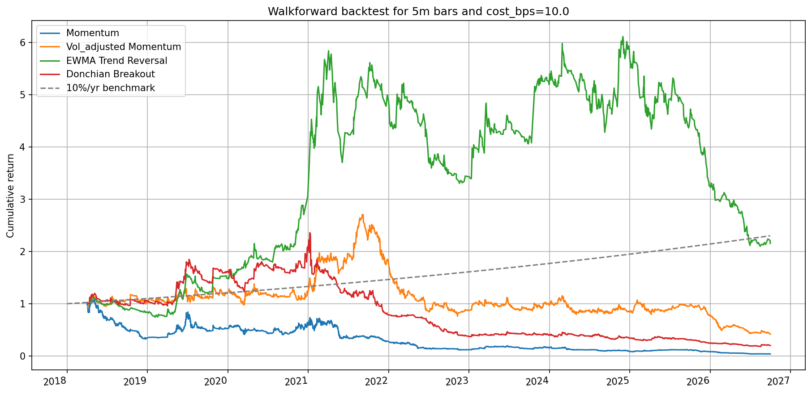
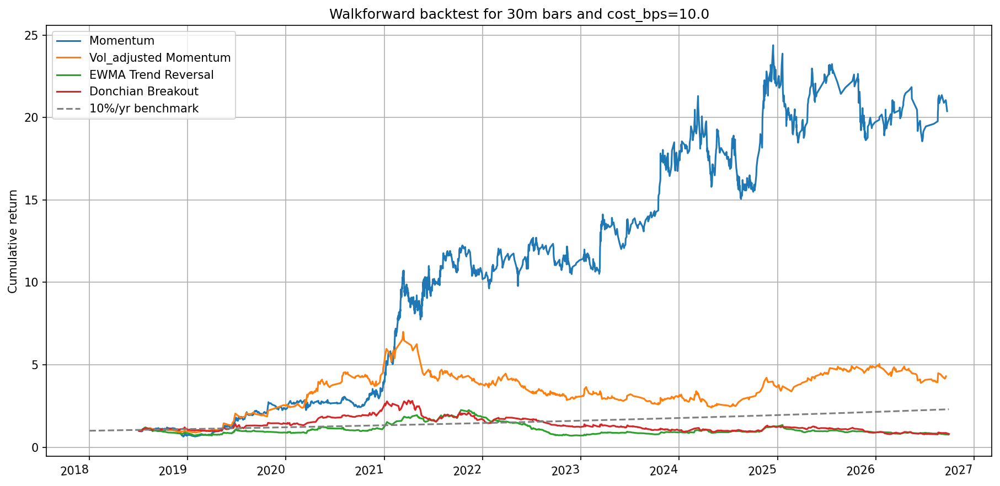
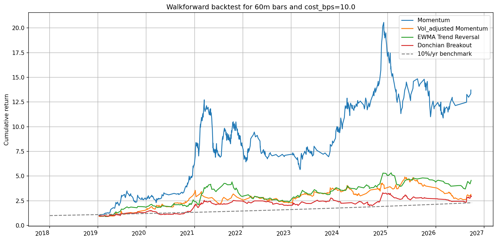

# Simple trading strats

Backtests of simple long-only intraday strategies on crypto spot (BTC, ETH, LTC, XRP against USD/USDT), with a shared evaluation module, a grid search, and a walk-forward test that re-fits each strategy's parameters on a rolling window.

This is research code, not trading advice.

## Contents

- [Repository layout](#repository-layout)
- [Strategies](#strategies)
- [How to use the code](#how-to-use-the-code)
- [Walk-forward results](#walk-forward-results)
- [Assumptions and limitations](#assumptions-and-limitations)
- [Planned](#planned)

## Repository layout

```
Simple_trading_strats/          # the root folder must keep this name: data paths are resolved from it
├── README.md
├── Data/                       # created on first download
│   ├── binance/
│   │   ├── cache/              # raw kline zips from data.binance.vision
│   │   └── raw_data_{5m,30m,60m}.parquet
│   └── yf/
│       └── raw_data_{5m,30m,60m}.csv
├── results/                    # walk-forward plots shown below
└── src/
    ├── data.py                 # yfinance loader
    ├── data_binance.py         # Binance public-data loader
    ├── strat_eval.py           # trade-list evaluation, costs, Sharpe, trade plots
    ├── grid_search.py          # parameter grids, grid search, ranking
    ├── walkforward.py          # rolling re-fit and out-of-sample backtest
    └── strategies/
        ├── accurate_momentum.py
        ├── vol_adjusted_momentum.py
        ├── trend_reversal.py
        ├── donchian_breakout.py
        ├── short_reversal.py
        └── basic_momentum.py, refined_momentum.py, momentum_fixed_horizon.py
```

The last three files are earlier or alternative momentum variants (close-only fills, and a fixed holding horizon). They still run through the same evaluation code but are not described here.

## Strategies

| Strategy | File | Signal | Exit | In walk-forward |
|---|---|---|---|---|
| Momentum | `accurate_momentum.py` | Lookback return above a fixed threshold | Fixed take-profit / stop-loss barriers | Yes |
| Vol-adjusted momentum | `vol_adjusted_momentum.py` | Lookback return in units of its own volatility | Volatility-scaled barriers plus a time stop | Yes |
| EWMA trend | `trend_reversal.py` | Normalised fast-minus-slow EWMA of log price | Signal falls below an exit band | Yes |
| Donchian breakout | `donchian_breakout.py` | New high over a rolling channel | ATR trailing stop | Yes |
| Short-horizon reversal | `short_reversal.py` | Large drop relative to a fitted random walk + AR(1) model | Time exit scaled by the fitted half-life | No |

### Conventions shared by all strategies

- Long-only, one position at a time, full notional per trade.
- A signal computed on the close of bar $t$ is traded at the open of bar $t+1$. The only exception is the Donchian breakout in intrabar mode.
- Every window parameter is given in **minutes** and converted to bars by integer division with the bar size, so the same configuration can be run on 5m, 30m or 60m bars.
- Lags are counted in bars rather than clock time, which suits markets that trade 24/7 without session breaks.
- Each strategy exposes a `master_*` function that returns `(df, trades, dates)`, where `trades` is a list of `(price_in, price_out)` and `dates` a list of `(date_in, date_out)`. The two barrier strategies also return `n_ambiguous` for the number of trades executed without ordering of High/Low.

### 1. Momentum (`accurate_momentum.py`)

Buy after a strong move over the last `change_period` minutes and hold until a fixed percentage barrier is hit.

With $n$ the lookback in bars, the signal is the simple return

$$R_t = \frac{C_t}{C_{t-n}} - 1$$

**Entry.** If $R_t \ge$ `in_cond`, buy at the next open $p_{in} = O_{t+1}$. The barriers are fixed at entry: take-profit at $p_{in} \cdot$ `take_profit` and stop-loss at $p_{in} \cdot$ `stop_loss` (multipliers such as 1.015 and 0.985).

**Exit.** While the entry signal is still on, the position is held and the barriers are not evaluated. On bars where the signal is off, the rules below are checked in order:

| Order | Condition on the bar | Fill price | Why |
|---|---|---|---|
| 1 | Open is already beyond either barrier | Open | The market gapped through the level, so the barrier price was never available |
| 2 | High reaches take-profit and low reaches stop-loss | Stop-loss | The order of the two touches is unknown from OHLC, so the pessimistic one is assumed. Counted in `n_ambiguous` |
| 3 | High reaches take-profit | Take-profit | |
| 4 | Low reaches stop-loss | Stop-loss | |

This fill model is what "accurate" refers to: it uses the full OHLC bar instead of closes, so exits are not delayed by a bar and gaps are not filled at prices that never traded. The share of ambiguous exits is reported so you can tell when the bar size is too coarse for the barrier width.

| Parameter | Meaning |
|---|---|
| `change_period` | Lookback of the momentum return, in minutes |
| `in_cond` | Entry threshold on the lookback return (0.01 = 1%) |
| `take_profit`, `stop_loss` | Barrier levels as multiples of the entry price |

### 2. Vol-adjusted momentum (`vol_adjusted_momentum.py`)

The same idea with every threshold expressed in units of recent volatility, so a 1% move in a quiet market and a 1% move in a turbulent one are no longer treated as the same event.

Per-bar volatility $\sigma_{bar}$ is the rolling standard deviation of one-bar returns over `vol_window`. Scaled to the lookback horizon by the square-root-of-time rule, it gives the signal

$$\sigma_L = \sigma_{bar}\sqrt{n}, \qquad z_t = \frac{C_t / C_{t-n} - 1}{\sigma_L}$$

**Entry.** If $z_t \ge$ `z_in` (and $\sigma_L$ is finite and above `min_sigma`), buy at the next open.

**Barriers.** $\sigma_L$ is frozen at the signal bar and sets the barrier widths:

$$TP = p_{in}\,(1 + k_{tp}\,\sigma_L), \qquad SL = p_{in}\,(1 - k_{sl}\,\sigma_L)$$

with $k_{tp}$ = `tp_sigma` and $k_{sl}$ = `sl_sigma`. Fills follow the same four rules as the momentum strategy, and the position is likewise held while $z_t \ge$ `z_in`.

**Time stop.** For a driftless diffusion with symmetric barriers at $\pm k\sigma_L$, the expected time to touch a barrier is $k^2 n$ bars. A trade that has lasted longer than a multiple of that is closed at the next open:

$$\text{max bars} = \lceil \tau \cdot k_{tp}^2 \cdot n \rceil$$

where $\tau$ is `tau_mult`.

| Parameter | Meaning |
|---|---|
| `change_period` | Lookback of the momentum return, in minutes |
| `vol_window` | Window of the volatility estimate, in minutes (default 2 days) |
| `z_in` | Entry threshold on the z-score |
| `tp_sigma`, `sl_sigma` | Barrier distances in units of $\sigma_L$ |
| `tau_mult` | Time stop as a multiple of the expected barrier-touch time |
| `min_sigma` | Volatility floor below which no trade is opened |

### 3. EWMA trend (`trend_reversal.py`)

A fast/slow moving-average crossover on log prices, normalised so that the entry threshold reads as a z-score. In the plots it is labelled "EWMA Trend Reversal".

With $p_t = \log C_t$, one-bar log returns $r_t$, and $\lambda = (\text{span} - 1)/(\text{span} + 1)$ for each EWMA, the difference of the two averages is a weighted sum of past returns:

$$D_t = \text{EWMA}_{fast}(p)_t - \text{EWMA}_{slow}(p)_t = \sum_{j \ge 0} w_j\, r_{t-j}, \qquad w_j = \lambda_s^{\,j+1} - \lambda_f^{\,j+1}$$

If returns were i.i.d. with no drift and volatility $\sigma$, $D_t$ would have standard deviation $\sigma \lVert w \rVert_2$, which has a closed form. The signal is therefore

$$\tilde{D}_t = \frac{D_t}{\sigma_t\, \lVert w \rVert_2}$$

where $\sigma_t$ is an EWMA volatility of one-bar log returns over the slow span. $\tilde{D}_t$ is roughly standard normal when there is no trend, so `in_cond = 2` means "the crossover is two standard deviations away from what noise alone would produce".

**Entry.** $\tilde{D}_t \ge$ `in_cond`, filled at the next open.
**Exit.** $\tilde{D}_t \le$ `out_cond`, filled at the next open. Using `out_cond < in_cond` gives a hysteresis band that avoids flipping in and out around a single threshold.

The first `burn_spans` slow spans are discarded as warm-up. The module also stores a local drift estimate, `mu_hat` $= D_t / (L_s - L_f)$ with $L$ the average lag of each EWMA, and provides `in_cond_floor`, the smallest entry threshold at which the expected captured drift pays for the round-trip cost.

| Parameter | Meaning |
|---|---|
| `fast_window`, `slow_window` | EWMA spans, in minutes |
| `in_cond`, `out_cond` | Entry and exit thresholds on the normalised signal |
| `burn_spans` | Warm-up length, in slow spans |

### 4. Donchian breakout (`donchian_breakout.py`)

Buy when price makes a new high over a rolling channel, then trail a stop below the price at a distance measured in ATR.

The upper channel uses only bars before $t$, so a breakout on bar $t$ is tradable within that bar:

$$U_t = \max_{t-N \le s < t} H_s$$

Volatility is the Wilder ATR over $P$ bars:

$$TR_t = \max\left(H_t - L_t,\ |H_t - C_{t-1}|,\ |L_t - C_{t-1}|\right), \qquad ATR_t = ATR_{t-1} + \frac{TR_t - ATR_{t-1}}{P}$$

The first $5P$ bars of ATR are discarded as warm-up. Two fill models are available:

| | `intrabar=True` | `intrabar=False` |
|---|---|---|
| Entry condition | $H_t \ge U_t$ | $C_t > U_t$ |
| Entry fill | $\max(O_t, U_t)$ on bar $t$ | $O_{t+1}$ |
| Initial stop | entry $- k \cdot ATR_{t-1}$ | entry $- k \cdot ATR_t$ |
| Exit condition | $L_t \le S_{t-1}$ | $C_t \le S_{t-1}$ |
| Exit fill | $\min(O_t, S_{t-1})$ on bar $t$ | $O_{t+1}$ |

**Trailing stop.** The stop only ever moves up:

$$S_t = \max\left(S_{t-1},\ A_t - k \cdot ATR_t\right)$$

where the anchor $A_t$ is the highest high since entry when `chandelier=True`, and the current close otherwise. A bar that makes a new breakout does not trigger an exit, which prevents closing and re-opening on the same bar.

| Parameter | Meaning |
|---|---|
| `lookback` | Channel length $N$, in minutes |
| `period` | ATR period $P$, in minutes |
| `k` | Stop distance in ATR multiples |
| `chandelier` | Anchor the stop to the running high instead of the close |
| `intrabar` | Intrabar fills instead of close-confirmed, next-open fills |

Because ATR is measured per bar, sensible values of `k` depend on the bar size, which is why the grids differ across 5m, 30m and 60m.

### 5. Short-horizon reversal (`short_reversal.py`)

Buy after a drop that is large relative to what a fitted price model can explain, on the view that part of it is transient noise that will mean-revert.

Log price is modelled as a permanent plus a transient component:

$$p_t = m_t + u_t, \qquad m_t = m_{t-1} + \eta_t, \qquad u_t = \phi\, u_{t-1} + \varepsilon_t$$

where $m_t$ is a random walk with increment volatility $\sigma_m$, and $u_t$ is a stationary AR(1) with stationary volatility $\sigma_u$. The parameters $(\sigma_m, \sigma_u, \phi)$ are estimated by Kalman-filter maximum likelihood (`statsmodels` `UnobservedComponents`) on a trailing `fit_window`, re-fitted every `refit_window`. A fit on bars up to $t-1$ is first used at bar $t$, so there is no look-ahead.

Under the model, the variance of the $L$-bar log return $R_t = p_t - p_{t-L}$ is

$$\text{Var}_L = L\,\sigma_m^2 + 2\,\sigma_u^2\,(1 - \phi^L), \qquad z_t = \frac{R_t}{\sqrt{\text{Var}_L}}$$

**Entry.** $z_t \le -$`z_in`, filled at the next open.
**Exit.** At the open after a holding time tied to the half-life of the transient component:

$$\text{hold} = \left\lceil k \cdot \frac{\ln 2}{-\ln \phi} \right\rceil \text{ bars}$$

where $k$ is `k_halflife`, with a minimum of one bar and a cap of `max_hold`. No trade is opened when $\phi \le 0$, since the half-life is then undefined.

| Parameter | Meaning |
|---|---|
| `lookback` | Horizon $L$ of the return being tested, in minutes |
| `fit_window`, `refit_window` | Length of the estimation window and re-fit frequency, in minutes |
| `z_in` | Entry threshold (the strategy buys at $z \le -$`z_in`) |
| `k_halflife` | Holding time in half-lives |
| `max_hold` | Cap on the holding time, in minutes (`inf` for none) |

## How to use the code

### Setup

Python 3.10 or newer.

```bash
pip install numpy pandas scipy statsmodels matplotlib mplfinance yfinance requests pyarrow joblib
```

Run everything from the repository root so that the `src.` imports resolve. The files are written with `# %%` cell markers, so they can also be run cell by cell in VS Code or any editor with Jupyter-style cells.

### 1. Download data

| Source | Command | Output | Use |
|---|---|---|---|
| Binance public data | `python -m src.data_binance` | `Data/binance/raw_data_{interval}.parquet` | Full history from 2018, used by the walk-forward |
| yfinance | `python -m src.data` | `Data/yf/raw_data_{interval}.csv` | Short recent intraday history, handy for quick checks |

Notes on the Binance loader:

- Set `intervals` near the bottom of `data_binance.py` to the bar sizes you need, in Binance notation: `['5m', '30m', '1h']`. The `1h` file is saved as `raw_data_60m.parquet`, and the rest of the code refers to that bar size as `'60m'`.
- Downloaded zips are checksum-verified and cached under `Data/binance/cache`, so rebuilding a combined file with `refresh = True` is fast.
- Keys follow the yfinance convention (`'BTC-USD'`), mapped internally to USDT pairs (`BTCUSDT`). Timestamps are UTC.

Both loaders run their download step on import if the combined file is missing, and skip it otherwise.

```python
from src.data_binance import get_data_binance
from src.data import get_data_yf

raw = get_data_binance('5m')     # dict: ticker -> OHLCV DataFrame
df = raw['BTC-USD']
```

### 2. Run a single strategy

```python
from src.data_binance import get_data_binance
from src.strategies.vol_adjusted_momentum import master_vol_adjusted_momentum
from src.strat_eval import strat_data, restrict_to_window

raw = get_data_binance('5m')

df, trades, dates, n_ambiguous = master_vol_adjusted_momentum(
    ticker='BTC-USD', data=raw, interval='5m',
    change_period=240, z_in=1.5, tp_sigma=1.6, sl_sigma=1.6,
)

# optional: evaluate on a sub-period (signals are still computed on the full history)
df, trades, dates = restrict_to_window(df, trades, dates, '2024-01-01', '2025-01-01')

profits, total_profit, equity, final_multiple, sharpe = strat_data(
    'BTC-USD', df, trades, dates,
    strategy='vol_adjusted', amount=10_000, accumulates=True,
    cost_bps=10.0, verbose=True, plot=False,
)
```

`strat_data` prints the number of trades, win rate, total profit, cumulative return and Sharpe. With `plot=True` it draws a candlestick chart with entry and exit markers, which is only practical on a short window.

`python -m src.strat_eval` runs the configurations stored at the bottom of `strat_eval.py` and prints a comparison table.

### 3. Grid search

```python
from src.grid_search import grid_search, summarise, param_grids, eval_params, constraints

strategy = 'donchian_breakout'
grid = param_grids[strategy]

results = grid_search(
    strategy=strategy, ticker='BTC-USD', data=raw, interval='5m',
    grid=grid, eval_kwargs=eval_params[strategy],
    constraint=constraints.get(strategy),
)
ranked = summarise(results, grid_keys=list(grid))
```

`grid_search` returns one row per parameter combination with `n_trades`, `total_return`, `cagr`, `sharpe`, `sharpe_per_trade`, `win_rate`, `avg_trade_ret`, `profit_factor` and `max_drawdown`. `summarise` ranks by Sharpe among combinations with at least `MIN_TRADES` trades, and prints how sensitive the metric is to each parameter, so that you can prefer a plateau over an isolated peak.

Base parameters live in `strat_params`, grids in `param_grids`, and validity rules (for example fast window shorter than slow window) in `constraints`.

### 4. Walk-forward backtest

```python
from src.walkforward import backtest_returns, eval_params

bars_per_day = 24 * 60 // 5
pnl, profit, returns, equity, dates, params_log = backtest_returns(
    ticker='BTC-USD', data=raw, interval='5m', strategy='donchian_breakout',
    lookback=90 * bars_per_day, rebalance_freq=30 * bars_per_day,
    eval_kwargs=eval_params['donchian_breakout'], rank_by='sharpe', min_trades=20,
)
equity.plot()            # cumulative return, indexed by trade exit time
params_log               # parameters chosen at each re-fit
```

At each re-fit time $t$:

1. **Train** on $[t - \text{lookback},\ t)$: run the grid and keep the combination with the best Sharpe among those with at least `min_trades` trades. If none qualifies, the strategy stays flat for the period.
2. **Test** on $[t,\ t + \text{rebalance})$ with those parameters. The strategy is run on the training and test bars together so that indicators are already warm at $t$, but only trades entered inside the test window are kept.

Test windows are disjoint, and their trades are chained into a single out-of-sample return series.

`python -m src.walkforward` runs all four strategies on BTC-USD for 5m, 30m and 60m bars and shows one figure per bar size. A full grid search is repeated at every re-fit, so expect a long runtime, particularly on 5m bars. The grids are defined per bar size in `param_grids` inside `walkforward.py`.

### Adding a strategy

1. Create `src/strategies/<name>.py` with a `master_<name>(ticker, data, interval, **params)` function returning `(df, trades, dates)`.
2. Register it in `strat_params` and `param_grids` in both `grid_search.py` and `walkforward.py`, and add a rule to `constraints` if some combinations are invalid.

## Walk-forward results

BTC-USD, Binance spot data, 10,000 USD starting capital with profits reinvested, 10 bps cost per side. Parameters are selected by in-sample Sharpe with a minimum of 20 trades.

| Bar size | Training window | Re-fit every |
|---|---|---|
| 5m | 90 days | 30 days |
| 30m | 180 days | 30 days |
| 60m | 365 days | 60 days |

Each figure shows the out-of-sample cumulative return of the four strategies, with a constant-growth benchmark as a dashed grey line.

`walkforward.py` saves each figure to `results/walkforward_{interval}.png` just before `plt.show()`, with paths relative to the repository root:

```python
os.makedirs('results', exist_ok=True)
plt.savefig(f'results/walkforward_{interval}.png', dpi=150, bbox_inches='tight')
```

<!--
PLOT PLACEHOLDERS
Each image tag below points to a file in results/. Two ways to fill them in:
  (a) Save the figure to the path shown and commit it. The tag then works as is.
  (b) Edit this README on github.com and drag the image into the editor. GitHub uploads it
      and inserts a line like .
      Replace the placeholder tag with that line.
Paths are relative to the repository root. To control the size, use HTML instead:
  
-->

### 5m bars

<!-- placeholder: results/walkforward_5m.png -->


### 30m bars

<!-- placeholder: results/walkforward_30m.png -->


### 60m bars

<!-- placeholder: results/walkforward_60m.png -->


## Assumptions and limitations

- **Costs.** `cost_bps` is charged per side, on both the entry and the exit notional. The net return of a trade is

  $$r = \frac{p_{out} - p_{in}}{p_{in}} - c\,\frac{p_{in} + p_{out}}{p_{in}}$$

  with $c$ equal to `cost_bps` divided by 10,000, so 10 bps per side is about 20 bps per round trip. There is no additional slippage model: barrier and stop fills are assumed at the stated level unless the bar opens beyond it.
- **Sharpe.** Computed from per-trade returns and annualised by the square root of the number of trades per year, with no risk-free rate. It is not a Sharpe ratio of daily returns, and it ignores time spent out of the market.
- **Equity curves** compound trade by trade and only move at trade exits.
- **Open positions.** Strategies only emit closed trades. A position still open at the end of the data, or at the end of a walk-forward test window, is not counted.
- **Scope.** Long-only, one asset at a time, full notional per trade, no leverage or funding. The walk-forward results cover BTC-USD only.
- **Bar-count windows.** Lookbacks assume a continuous 24/7 market. Gaps in the data shorten the effective clock-time window.

## Planned

- Notebooks that display the data, more extensive walk-forward results, multi ticker strategies.